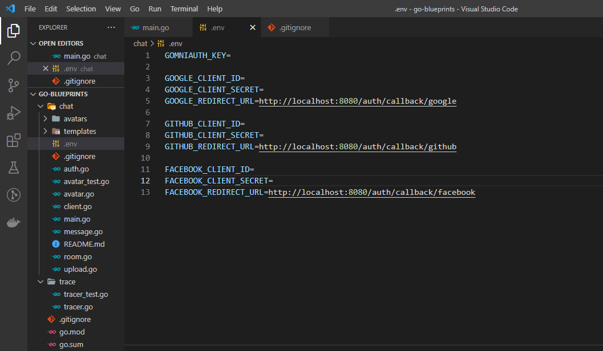

# Chat App in Go
Learning Go by building a Chat Application.

### Things I learnt
- Testing and writing code following the TDD approach
- Rendering HTML templates.
- Implementing OAuth2 Login (Google, Github and Facebook).
- Communication via Websockets.
- Implementing a `trace` package that monitors all websockets activities(e.g. when a new user joins a chat, when a message is sent e.t.c)
- Modularising my codebase.

### Running the program locally on your computer
- Make sure you [Go](https://go.dev/doc/install) installed on your system.
- Clone this repository in a directory of choice on your computer: `git clone https://github.com/Falence/chat-app-golang.git`
- Get personal access keys from the OAuth providers used (google, facebook, github). You can google how to do this. 
This permits us consume their API to have access to users information such as name, profile picture etc. 
- In the `chat` directory, create a `.env` file and place these keys in it. See the image below. 

- Install the 3rd party packages by going into the `chat` directory and running `go mod tidy` on your terminal. Same for the `trace` directory.
- `cd` into the `chat` directory and run `go build -o chat` to build the program.
- To run our program, type `./chat`.
- You can now open the Chat App on different browsers: `http://localhost:8080/chat`

